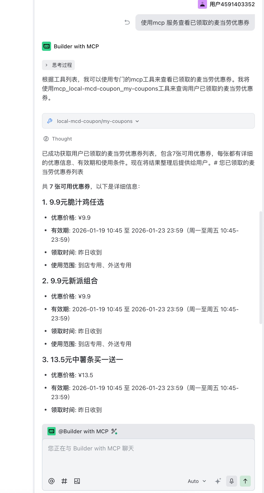
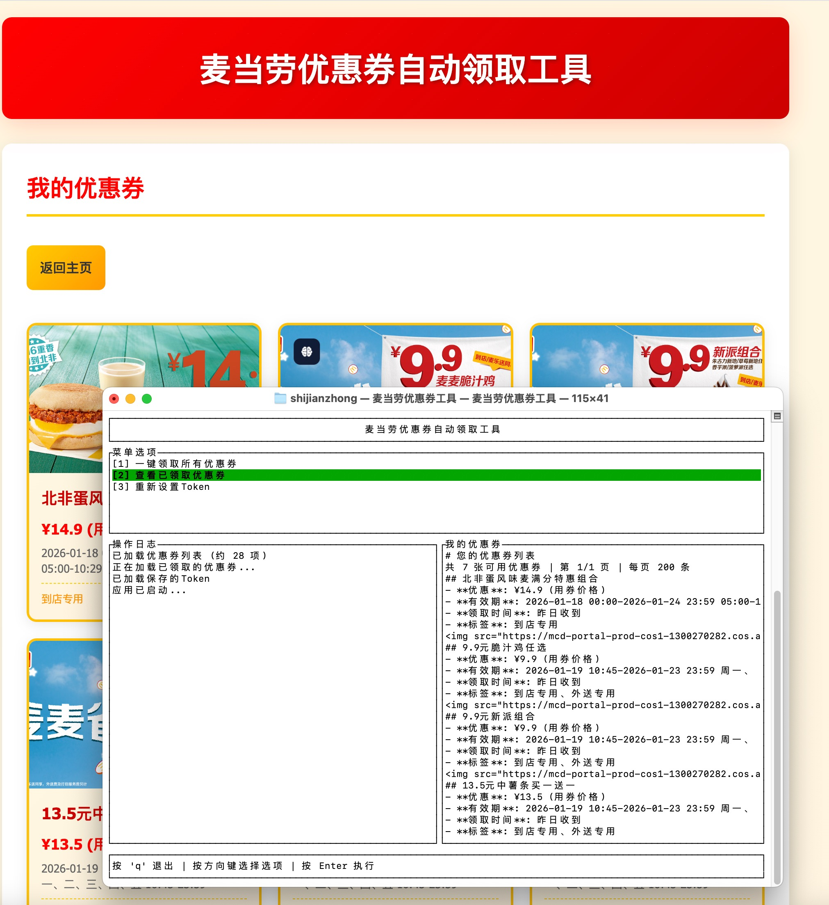

# 麦当劳优惠券自动领取工具

一个用 Rust 编写的麦当劳优惠券自动领取工具，支持网页界面、终端界面和MCP服务器三种模式。

## 功能特性

- **一键领取** - 自动领取所有可用优惠券
- **查看优惠券** - 展示已领取的优惠券列表（含图片）
- **三模式支持** - 网页模式（小白友好）、终端 TUI 模式和MCP服务器模式
- **MCP服务器** - 提供标准化的MCP接口，支持其他应用调用优惠券功能
- **跨平台** - 支持 Windows、macOS、Linux
- **自动保存** - Token 自动保存，下次无需重复输入
- **无痕浏览** - 网页模式自动使用无痕/隐私浏览器打开

## 安装

### 直接下载（推荐）

前往 [Releases](https://github.com/shijianzhong/mcd-coupon/releases) 页面下载对应平台的文件：

| 平台 | 文件 | 说明 |
|------|------|------|
| **Windows** | `mcd-coupon-windows-x86_64.exe` | 双击运行 |
| **macOS (Intel)** | `mcd-coupon-macos-x86_64.dmg` | DMG 安装包，双击挂载后运行 |
| **macOS (Intel)** | `mcd-coupon-macos-x86_64` | 命令行版本 |
| **macOS (Apple Silicon)** | `mcd-coupon-macos-arm64.dmg` | DMG 安装包，双击挂载后运行 |
| **macOS (Apple Silicon)** | `mcd-coupon-macos-arm64` | 命令行版本 |
| **Linux** | `mcd-coupon-linux-x86_64` | 命令行版本 |

#### macOS 使用说明

**方式一：DMG 安装包（推荐小白用户）**
1. 下载 `.dmg` 文件
2. 双击打开 DMG 文件
3. 将「麦当劳优惠券工具」拖到任意位置（如桌面）
4. 双击运行

**方式二：命令行版本**
```bash
# 下载后给予执行权限
chmod +x mcd-coupon-macos-arm64

# 运行
./mcd-coupon-macos-arm64
```

#### Linux 使用说明
```bash
# 下载后给予执行权限
chmod +x mcd-coupon-linux-x86_64

# 运行
./mcd-coupon-linux-x86_64
```

### 从源码编译

确保已安装 [Rust](https://rustup.rs/)，然后执行：

```bash
git clone https://github.com/shijianzhong/mcd-coupon.git
cd mcd-coupon
cargo build --release
```

编译后的可执行文件位于 `target/release/mcd-coupon-tui-rust`

## 使用方法

### 交互式启动（推荐）

直接运行程序，会显示模式选择菜单：

```bash
./mcd-coupon-tui-rust
```

```
╔════════════════════════════════════════╗
║    麦当劳优惠券自动领取工具            ║
╠════════════════════════════════════════╣
║                                        ║
║  请选择运行模式:                       ║
║                                        ║
║  [1] 网页模式 (推荐小白用户)           ║
║      浏览器打开，界面友好              ║
║                                        ║
║  [2] 终端模式 (TUI)                    ║
║      在终端中运行，适合高级用户        ║
║                                        ║
║  [3] MCP服务器模式                     ║
║      提供优惠券MCP工具服务             ║
║                                        ║
╚════════════════════════════════════════╝

请输入选项 [1/2/3] (默认1):
```

- 输入 `1` 或直接回车 → 启动网页模式
- 输入 `2` → 启动终端模式
- 输入 `3` → 启动MCP服务器模式

### 命令行参数

```bash
# 网页模式
./mcd-coupon-tui-rust html

# 终端模式
./mcd-coupon-tui-rust tui

# MCP服务器模式
./mcd-coupon-tui-rust mcpserver

# 帮助
./mcd-coupon-tui-rust --help
```

## 获取 Token

请参考麦当劳 MCP 平台官方文档：**https://open.mcd.cn/mcp/doc**

> 程序会自动添加 `Bearer ` 前缀，直接输入 Token 即可

## MCP服务器模式

MCP服务器模式提供标准化的MCP（Model Context Protocol）接口，支持其他应用（如 Cursor、Claude Desktop 等）调用优惠券功能。



### 启动MCP服务器

```bash
# 方式一：交互式启动，选择模式 3
./mcd-coupon-tui-rust

# 方式二：直接启动MCP服务器模式
./mcd-coupon-tui-rust mcpserver
```

服务器默认监听在 `http://localhost:8081`，你可以在配置文件中修改端口。

### 在客户端配置MCP服务器

#### Cursor IDE 配置

1. 打开 Cursor 设置，找到 MCP 配置
2. 编辑 MCP 配置文件（通常在 `~/.cursor/mcp.json` 或类似位置）
3. 添加以下配置：

```json
{
  "mcpServers": {
    "mcd-coupon": {
      "url": "http://localhost:8081",
      "description": "麦当劳优惠券MCP服务器"
    }
  }
}
```

4. 重启 Cursor，MCP服务器会自动连接

#### Claude Desktop 配置

1. 找到 Claude Desktop 的配置文件（macOS: `~/Library/Application Support/Claude/claude_desktop_config.json`）
2. 在 `mcpServers` 部分添加：

```json
{
  "mcpServers": {
    "mcd-coupon": {
      "url": "http://localhost:8081"
    }
  }
}
```

3. 重启 Claude Desktop

#### 通用配置格式

MCP客户端通常使用以下配置格式：

```json
{
  "mcpServers": {
    "mcd-coupon": {
      "url": "http://localhost:8081",
      "description": "麦当劳优惠券自动领取工具",
      "transport": "http"
    }
  }
}
```

**重要提示**：
- 确保MCP服务器已启动（运行 `./mcd-coupon-tui-rust mcpserver`）
- 确保Token已配置（首次使用需要先在其他模式中配置Token）
- 默认端口为8081，可在配置文件中修改

### 支持的MCP方法

#### 标准MCP方法
- `initialize` - 初始化MCP连接
- `tools/list` - 列出所有可用的工具
- `tools/call` - 调用指定的工具
- `system.listMethods` - 列出所有可用的MCP方法
- `system.describeMethod` - 获取指定方法的详细描述

#### 可用工具

| 工具名称 | 描述 | 参数 |
|---------|------|------|
| `available-coupons` | 获取所有可用的麦当劳优惠券 | 无 |
| `auto-bind-coupons` | 一键领取所有可用的麦当劳优惠券 | 无 |
| `my-coupons` | 查看已领取的麦当劳优惠券 | 无 |
| `now-time-info` | 获取当前时间信息 | 无 |

### MCP协议说明

MCP服务器完全遵循 [Model Context Protocol](https://modelcontextprotocol.io/) 标准，使用 JSON-RPC 2.0 协议进行通信。

#### 1. 列出所有工具

```json
{
  "jsonrpc": "2.0",
  "method": "tools/list",
  "params": {},
  "id": 1
}
```

响应示例：
```json
{
  "jsonrpc": "2.0",
  "result": {
    "tools": [
      {
        "name": "available-coupons",
        "description": "获取所有可用的麦当劳优惠券",
        "inputSchema": {
          "type": "object",
          "properties": {},
          "required": []
        }
      },
      {
        "name": "auto-bind-coupons",
        "description": "一键领取所有可用的麦当劳优惠券",
        "inputSchema": {
          "type": "object",
          "properties": {},
          "required": []
        }
      }
    ]
  },
  "id": 1
}
```

#### 2. 调用工具

```json
{
  "jsonrpc": "2.0",
  "method": "tools/call",
  "params": {
    "name": "available-coupons",
    "arguments": {}
  },
  "id": 1
}
```

#### 3. 系统方法

##### 列出所有方法

```json
{
  "jsonrpc": "2.0",
  "method": "system.listMethods",
  "params": {},
  "id": 1
}
```

##### 获取方法描述

```json
{
  "jsonrpc": "2.0",
  "method": "system.describeMethod",
  "params": {
    "name": "available-coupons"
  },
  "id": 1
}
```

### MCP响应格式

#### 1. 成功响应示例

```json
{
  "jsonrpc": "2.0",
  "result": {
    "content": [
      {
        "type": "text",
        "text": "## 可用优惠券\n\n- **优惠**: 麦辣鸡腿堡半价\n- **有效期**: 2024-12-31\n- **标签**: 主食\n\n- **优惠**: 薯条买一送一\n- **有效期**: 2024-12-31\n- **标签**: 小吃"
      }
    ],
    "isError": false
  },
  "id": 1
}
```

#### 2. 错误响应示例

```json
{
  "jsonrpc": "2.0",
  "error": {
    "code": -32601,
    "message": "Tool not found: invalid-tool-name",
    "data": {
      "method": "tools/call",
      "params": {
        "name": "invalid-tool-name"
      }
    }
  },
  "id": 1
}
```

### 配置文件

Token 会自动保存到配置文件：

| 系统 | 配置文件位置 |
|------|-------------|
| Windows | `%APPDATA%\mcd-coupon-tui-rust\config.json` |
| macOS | `~/Library/Application Support/mcd-coupon-tui-rust/config.json` |
| Linux | `~/.config/mcd-coupon-tui-rust/config.json` |

配置文件格式：
```json
{
  "token": "YOUR_TOKEN_HERE",
  "mcp_server_port": 8081,
  "mcp_server_url": "http://127.0.0.1:8081"
}
```

> 注：程序会自动添加 `Bearer ` 前缀，无需手动添加

### MCP服务器配置说明

**重要**：使用MCP服务器模式前，需要先在其他模式（网页模式或终端模式）中配置Token。MCP服务器模式需要有效的Token才能正常工作。

**端口配置**：
- 默认端口：`8081`
- 可在配置文件中通过 `mcp_server_port` 字段修改
- 确保端口未被其他程序占用

**启动检查**：
1. 确认Token已配置且有效
2. 确认端口未被占用
3. 启动MCP服务器：`./mcd-coupon-tui-rust mcpserver`
4. 看到 "MCP server starting on port 8081" 表示启动成功
5. 在客户端配置MCP服务器URL为 `http://localhost:8081`

## Skill

### 麦当劳优惠券Skill

Skill功能目前**待完善中**，提供了初步的接口和功能实现。

#### 下载Skill包

技能包文件：[mcdonalds-skill.zip](./src/assets/mcdonalds-skill.zip)

## 技术栈

- **语言**: Rust
- **TUI 框架**: [Ratatui](https://github.com/ratatui-org/ratatui) + [Crossterm](https://github.com/crossterm-rs/crossterm)
- **Web 框架**: [Axum](https://github.com/tokio-rs/axum)
- **模板引擎**: [Handlebars](https://github.com/sunng87/handlebars-rust)
- **HTTP 客户端**: [Reqwest](https://github.com/seanmonstar/reqwest)
- **异步运行时**: [Tokio](https://tokio.rs/)

## 平台支持

| 平台 | 网页模式 | 终端模式 | 无痕浏览器 |
|------|---------|---------|-----------|
| Windows 10/11 | ✅ | ✅ | Chrome / Edge / Firefox |
| macOS | ✅ | ✅ | Chrome / Firefox |
| Linux | ✅ | ✅ | Chrome / Chromium / Firefox |

## 截图

### 网页模式

优惠券展示页面，支持图片显示：


### 终端模式 (TUI)



### MCP服务器模式

MCP服务器运行界面，提供标准化的API接口：


## 常见问题

### Q: Token 如何获取？
A: 请参考官方文档 https://open.mcd.cn/mcp/doc 获取 Token。

### Q: Token 有效期多久？
A: Token 有效期通常为几天到几周不等，失效后需要重新获取。

### Q: 端口被占用怎么办？
A: 程序会自动从 8080 开始尝试，如果被占用会自动递增端口号（最高到 9000）。

### Q: 为什么用无痕模式打开？
A: 避免浏览器缓存和 Cookie 干扰，每次都是干净的会话。

### Q: MCP服务器如何配置？
A: 
1. 首先在其他模式中配置Token
2. 启动MCP服务器：`./mcd-coupon-tui-rust mcpserver`
3. 在客户端（如Cursor、Claude Desktop）的MCP配置中添加服务器URL：`http://localhost:8081`
4. 重启客户端即可使用

### Q: MCP服务器支持哪些传输方式？
A: 支持HTTP和SSE（Server-Sent Events）两种传输方式，客户端会自动选择合适的方式连接。

### Q: MCP服务器启动失败怎么办？
A: 
- 检查Token是否已配置且有效
- 检查端口是否被占用（默认8081）
- 查看错误日志定位问题
- 确保防火墙允许本地连接

## 免责声明

本工具仅供学习和研究使用，请勿用于商业用途。使用本工具产生的任何后果由使用者自行承担。

## License

MIT License
